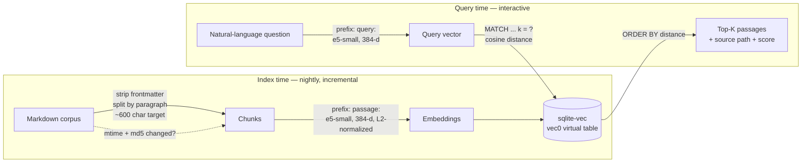

# Semantic Vault Search — a local, offline RAG retrieval engine

> **What this is.** A self-contained semantic search engine over a private
> Markdown corpus. It runs **fully offline** with **no vendor API**: a local
> sentence-embedding model turns notes and queries into vectors, a `sqlite-vec`
> vector store does cosine-similarity retrieval, and results come back ranked by
> meaning rather than keyword overlap. It is the **retrieval layer of a RAG
> system** — the "R" you wire under any LLM that needs grounded context.

This folder is a recruiter-legible extract of a component that runs in
production inside a larger personal-assistant codebase. The production code is
**not duplicated here** — the demo imports it directly (see
[Relationship to production](#relationship-to-production-code)).

---

## The problem

I keep a few thousand Markdown notes in a private knowledge base (an Obsidian
vault): infra runbooks, finance notes, project specs, journals. I want to ask it
questions in natural language and get the *right passage* back — even when I
don't remember the exact words I used when I wrote it.

Constraints that shaped the design:

| Constraint | Consequence |
|---|---|
| **Private corpus** | Notes can't be shipped to a third-party embedding API. |
| **Offline** | Must work on a laptop with no network (planes, travel). |
| **No recurring cost** | No per-query API spend. |
| **Recall by *concept*** | `"how I split my savings"` must find a note titled *"position weighting"* — zero shared keywords. |
| **Fast enough to feel instant** | Sub-100 ms per query after warmup. |

A first version (`vault-search` v1) used keyword expansion + `ripgrep`. It missed
roughly a third of queries because it still depended on literal token overlap.
**v2 replaces lexical matching with dense semantic retrieval.**

---

## The approach

```
                          INDEX TIME (batch, nightly cron)
  ┌────────────┐   chunk    ┌──────────┐  embed "passage:"  ┌──────────────┐
  │ .md corpus │ ─────────► │  chunks  │ ─────────────────► │  sqlite-vec  │
  │ (vault)    │ paragraph  │ ~600 chr │  e5-small (384-d)  │  vec0 table  │
  └────────────┘            └──────────┘   normalized       └──────────────┘
                                                                   ▲
                          QUERY TIME (interactive)                 │ cosine
  ┌────────────┐  embed "query:"   ┌──────────┐   MATCH + k = ?    │ top-K
  │ "question" │ ────────────────► │  vector  │ ───────────────────┘
  └────────────┘  e5-small (384-d) └──────────┘   ORDER BY distance
                                                        │
                                                        ▼
                                            ranked passages + source file
```

### Architecture (mermaid)



### Key design choices

**Embedding model — `intfloat/multilingual-e5-small`.**
384-dimensional, ~470 MB, strong FR/EN performance (the corpus is bilingual).
e5 is an *instruction-tuned asymmetric* model: documents must be embedded with a
`passage:` prefix and queries with a `query:` prefix. Honouring that asymmetry
is what makes a short question match a long note about the same idea. Small +
quantizable means it runs on a laptop CPU.

**Chunking — paragraph-based with a character cap.**
Split on blank lines, aggregate paragraphs up to a ~600-char target, hard-cap at
1500 (over-long paragraphs fall back to sentence splitting). YAML frontmatter is
stripped, sub-20-char fragments dropped. Rationale: a paragraph is the natural
unit of a single idea in Markdown, so each chunk embeds *one* coherent thought —
which keeps retrieval precise and the returned snippet readable.

**Vector store — `sqlite-vec`.**
A SQLite extension exposing a `vec0` virtual table with native cosine search.
Why SQLite and not a dedicated vector DB (FAISS, Qdrant, pgvector)? The corpus is
thousands of chunks, not millions; SQLite gives a **single-file, zero-server,
embeddable** store that ships in the same `~5 MB` DB as the chunk text and file
metadata. One `JOIN` returns the vector match *and* its source passage. For this
scale it is the right amount of machinery — no daemon to run, no container.

**Ranking.**
Vectors are L2-normalized at index *and* query time, so cosine distance is a
direct similarity measure. Retrieval is `WHERE embedding MATCH ? AND k = ?
ORDER BY distance` (sqlite-vec's KNN form). Displayed score is `(1 − distance)`
as a percent — higher is closer.

**Incremental indexing.**
The nightly job re-embeds a file only when both its `mtime` *and* its `md5` have
changed (so a `touch` doesn't trigger re-embedding), and prunes DB rows for files
deleted from disk.

### As a RAG building block

This is the **retrieval** stage of retrieval-augmented generation. To turn it
into full RAG you add one step: take the top-K passages this engine returns, pack
them into a prompt as grounding context, and let an LLM answer *from those
passages*. The hard, latency- and quality-critical part — getting the *right*
context in front of the model — is exactly what this component does. It is
deliberately decoupled from any specific LLM so the same index serves a CLI, a
chat bot, and batch jobs.

---

## Run it yourself

The demo runs the **real pipeline** on a tiny public sample corpus included in
[`sample_corpus/`](./sample_corpus) — five short notes on unrelated topics
(infra, investing, cooking, travel, fitness) — so you don't need the private
vault.

```bash
# from this folder
pip install "sentence-transformers>=2.7" sqlite-vec numpy   # ~once
python demo.py --bench
```

First run downloads the embedding model (~470 MB) into the HuggingFace cache.
**If the dependencies aren't installed, the demo degrades gracefully** — it
prints install instructions and exits cleanly instead of crashing.

```bash
python demo.py "your own question here"   # ad-hoc query
python demo.py -k 5                        # top-5 instead of top-3
```

---

## Worked example (actually produced by `demo.py`)

The five demo queries are written so a **keyword search would miss** the correct
note (no shared words with the target), but semantic retrieval finds it. Every
query below returns the right file as the **top hit**. Output captured from a
real run on the sample corpus:

```
Indexed 5 files / 6 chunks from sample_corpus/

Q: "what's my strategy for splitting up my savings"
   47.2%  investing.md    # How I size positions  My long-term capital is split between a tax-advantaged equity wrapper…
   39.5%  fitness.md      The goal is to add lean mass without losing the cardio base…
   39.1%  homelab.md      Snapshots run nightly to a separate disk pool…

Q: "keeping my home network secure"
   45.6%  homelab.md      # Running services at home  I keep a small rack of machines…
   37.6%  homelab.md      Snapshots run nightly to a separate disk pool…
   37.4%  investing.md    # How I size positions…

Q: "I get queasy on long bus rides"
   40.4%  travel.md       # How I like to travel  I favour Southeast and East Asia…  (note: "motion sickness")
   38.1%  fitness.md      The goal is to add lean mass…
   37.3%  cooking.md      A pot of rice and a fragrant tomato-and-onion base…

Q: "vegetarian comfort meal for a cold evening"
   49.2%  cooking.md      A pot of rice…  (note: slow-braised lentils over rice)
   ...

Q: "how do I bulk up without losing endurance"
   49.8%  fitness.md      The goal is to add lean mass without losing the cardio base…
   ...
```

Note the cross-vocabulary hits — *"queasy on long bus rides"* → the travel note
whose actual text is *"motion sickness"*; *"vegetarian comfort meal"* → the
cooking note about *"slow-braised lentils"*. No keyword engine makes those jumps.

### Measured numbers (this machine — Apple Silicon laptop, CPU only)

> Honest disclosure: these are tiny-corpus numbers I actually measured with
> `python demo.py --bench`. Your hardware and corpus will differ. The absolute
> latencies matter less than the shape: **one-time model load, then queries in
> tens of milliseconds.**

| Stage | Measured |
|---|---|
| Model load (cold, from disk cache) | ~10.6 s |
| Index build (6 chunks → embeddings → sqlite-vec) | ~0.35 s |
| Query, average of 5 | ~65 ms |
| Query, steady state (after the first warms PyTorch) | ~28–53 ms |

The cold model load is paid once per process; in production the CLI keeps it warm
within a session, and indexing is a nightly batch, so the interactive cost a user
feels is the per-query figure.

---

## Relationship to production code

This showcase **does not fork** the engine. `demo.py` imports the production
modules by path and calls their real functions:

- **Chunker** — `demo.py` imports `chunk_markdown()` straight from
  [`bin/jarvis-vault-index.py`](../../bin/jarvis-vault-index.py). The demo's index
  build is the same chunk → `passage:` prefix → embed → `vec0` flow as the
  production indexer.
- **Query path** — the demo's `search()` mirrors
  [`bin/vault-search-v2.py`](../../bin/vault-search-v2.py) exactly: the e5
  `query:` prefix and the `WHERE embedding MATCH ? AND k = ? ORDER BY distance`
  sqlite-vec query shape.

The only thing the demo substitutes is the **corpus** (tiny public fixtures
instead of the private vault) and the **DB location** (in-memory instead of
`~/.local/share/jarvis/vault.db`) — so it's runnable by anyone, while exercising
the production logic rather than a reimplementation.

Production reference docs:
[`docs/vault-search-v2.md`](../../docs/vault-search-v2.md) (engine) and
[`docs/vault-search-v1.md`](../../docs/vault-search-v1.md) (the keyword
predecessor it replaced).

---

## Files in this showcase

| File | Purpose |
|---|---|
| `README.md` | This write-up. |
| `demo.py` | Runnable demo: imports production chunker, builds an in-memory sqlite-vec index over the sample corpus, runs semantic queries, prints measured timings. Degrades gracefully without deps. |
| `sample_corpus/*.md` | Five short public notes so the demo runs without the private vault. |
